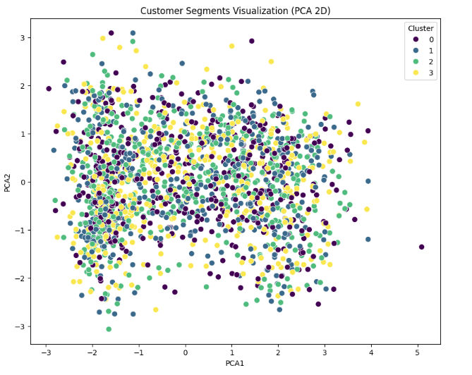

# 🎯 Customer Personality Analysis & Segmentation
> **An end-to-end Data Science project using K-Means Clustering and PCA to transform raw customer data into actionable marketing intelligence.**

---

## 📖 1. Problem Statement & Business Context
In the modern retail environment, a "one-size-fits-all" marketing strategy is no longer effective. This project addresses the challenge of understanding a diverse customer base by analyzing 2,240 customer profiles.

By identifying distinct personas, the business can shift from generic mass marketing to **personalized engagement**, thereby increasing the Return on Investment (ROI) for marketing campaigns and significantly improving customer retention.

---

## 🛠️ 2. Technical Workflow & Workflow
The project follows a rigorous Data Science pipeline to ensure data integrity and model reliability:

### **Phase A: Data Preprocessing & Cleaning**
*   **Imputation:** Handled missing values in the `Income` column using median imputation to maintain data distribution.
*   **Outlier Management:** Utilized the **IQR (Interquartile Range)** method to cap extreme values in `Income` and `Age`, preventing cluster centers from being skewed.
*   **Refining:** Removed redundant features and handled duplicate records to ensure a clean analytical base.

### **Phase B: Advanced Feature Engineering**
To capture the true essence of customer behavior, raw data points were combined into high-impact metrics:
*   **Customer Seniority (`Customer_Days`):** Measures days since enrollment to distinguish between long-term loyalists and new acquisitions.
*   **Share of Wallet (`Total_Spending`):** Aggregated spending across six product categories (Wines, Fruits, Meat, Fish, Sweets, and Gold).
*   **Family Dynamics (`Children`):** Consolidated kids and teenagers to understand household influence on purchasing.

### **Phase C: Dimensionality Reduction (PCA)**
The dataset originally contained over 25 features. To overcome the **"Curse of Dimensionality,"** I applied **Principal Component Analysis (PCA)**:
*   Reduced the feature space to **3 orthogonal components**.
*   Retained approximately **70% of the total variance**, ensuring the model focuses on significant patterns rather than random noise.

---

## 📊 3. Cluster Validation & Results
The optimal number of clusters was determined using a dual-validation approach:
1.  **The Elbow Method:** Identified the "point of diminishing returns" for Inertia.
2.  **Silhouette Analysis:** Confirmed that the resulting clusters were well-separated and cohesive.

### **Customer Segments Identified**
Based on the analysis, the customers are divided into 4 distinct groups:
*   **Cluster 0 (High-Value VIPs):** High income and high spending levels across all categories.
*   **Cluster 1 (Budget-Conscious):** Lower income, focused primarily on essential deals and discounts.
*   **Cluster 2 (Family-Oriented):** Larger households with moderate spending patterns.
*   **Cluster 3 (Loyal Seniors):** Older customers with high seniority and steady purchasing history.

---

## 📈 4. Visualizations

*The 2D PCA projection highlights the clear separation between segments, validating the K-Means clustering approach.*

---

## 💡 5. Strategic Recommendations
*   **Targeting VIPs:** Implement exclusive loyalty rewards and early access to premium products.
*   **Budget Shoppers:** Focus on discount-driven campaigns, coupons, and bundle deals.
*   **Family Retention:** Market bulk-buy offers and family-friendly product categories.

---

## 📂 Project Structure
*   `customer_segmentation.ipynb`: Main notebook with Python implementation.
*   `customer_segmentation.csv`: Raw dataset.
*   `Capture200.PNG`: Final cluster visualization.
## 6. Deep Dive: Technical Decisions & Methodology
Why PCA (Principal Component Analysis)?
The original dataset contained numerous features, leading to high dimensionality. Clustering algorithms like K-Means often struggle in high-dimensional spaces due to the "Curse of Dimensionality," where distance measurements become less meaningful. By applying PCA, I reduced the features to 3 orthogonal components that explain over 70% of the variance. This not only improved the algorithm's performance but also allowed for clear 2D visualization of customer behavior.

Feature Engineering Logic
To move beyond basic demographics, I engineered behavioral metrics:

Monetary Analysis (Total_Spending): Instead of looking at individual products, I aggregated spending to see the "Total Share of Wallet" for each customer.

Customer Seniority: Converting the Dt_Customer date into a numerical Customer_Days feature was critical for identifying long-term loyalists vs. recent shoppers.

Household Composition: By combining Kidhome and Teenhome, I created a clearer picture of family dynamics and their impact on spending volume.

Cluster Validation Strategy
I did not pick the number of clusters arbitrarily. I used a two-step validation:

Elbow Method: Observed the point where the rate of decrease in Inertia significantly slowed down (the "elbow").

Strategic Interpretation: After testing multiple configurations, 4 clusters were selected as they provided the most actionable and distinct business segments.

Handling Outliers
Rather than simply deleting outliers, which could represent our most profitable customers, I used the Interquartile Range (IQR) method to cap extreme values in Income and Age. This kept the data representative while ensuring that extreme outliers didn't skew the K-Means centroids, leading to more stable segments.
